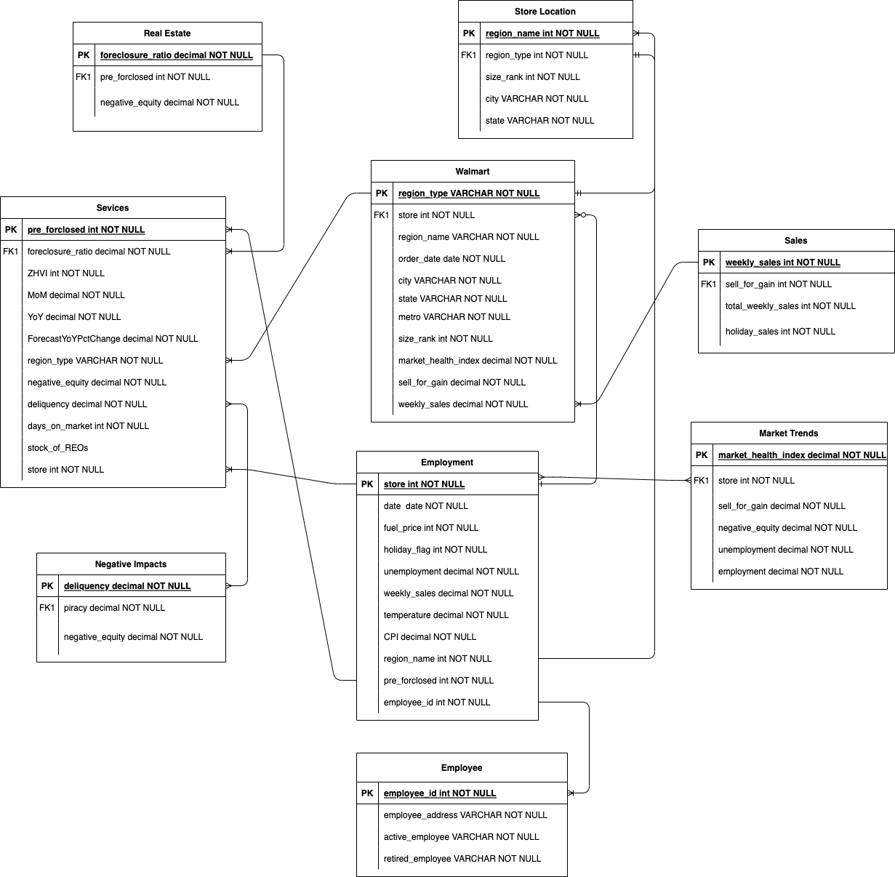

# Assignment 3 — Data Cleaning & SQLite Ingestion 🧹

<p align="center">
  
  
  
</p>

---

## 📖 Overview

This assignment covers the full data-ingestion pipeline: **gathering → cleaning → loading → querying**. Two Walmart-related CSV datasets are cleaned using pandas and loaded into a SQLite database for SQL analysis.

---

## 🗂️ Files

| File | Description |
|------|-------------|
| `Cleaning_Data.py` | Python script — cleans both datasets and loads into SQLite |
| `myCity.csv` | Dataset 1 — housing/market data by city (ZHVI, MarketHealthIndex, etc.) |
| `Walmart.csv` | Dataset 2 — weekly store sales with economic indicators |
| `Cleaned.csv` | Cleaned output of Dataset 1 |
| `Cleaned_DB.db` | SQLite database with `walmart`, `services`, and `employment` tables |
| `SQL and Use cases` | 15 analytical SQL queries with JOINs |
| `UML__Assignment_3.png` | UML diagram for the database schema |

---

## 🔄 Pipeline Flow

```
myCity.csv ──→ clean & split ──→ Cleaned.csv ──→ SQLite: walmart table
                    │                  └──────→ SQLite: services table
                    │
Walmart.csv ───────┘ (no nulls) ──────────────→ SQLite: employment table
                                                        │
                                                 Cleaned_DB.db
```

#### 1. Collect Data
- `myCity.csv` — City-level housing market indicators (Kaggle)
- `Walmart.csv` — Store-level weekly sales for 45 stores (Kaggle)

#### 2. Clean with pandas
- **Dataset 1 (myCity.csv):** audit nulls → drop `StockOfREOs`, `PrevForeclosed`, `ForeclosureRatio` → impute remaining with bfill/ffill → export to `Cleaned.csv`
- **Dataset 2 (Walmart.csv):** no missing values — loaded directly

#### 3. Load into SQLite
| Table | Columns | Source |
|-------|---------|--------|
| `walmart` | RegionType, RegionName, City, State, Metro, SizeRank, MarketHealthIndex, SellForGain | Cleaned.csv |
| `services` | ZHVI, MoM, YoY, ForecastYoYPctChange, NegativeEquity, Delinquency, DaysOnMarket | Cleaned_1.csv |
| `employment` | Store, Date, Weekly_Sales, Holiday_Flag, Temperature, Fuel_Price, CPI, Unemployment | Walmart.csv |

#### 4. SQL Analysis — 15 queries covering aggregations, filters, JOINs, and subqueries (see below)

---

## 🔍 SQL Use Cases

| # | Question | Key SQL |
|---|----------|---------|
| 1 | Total weekly sales per store | `SUM(Weekly_Sales) ... GROUP BY Store` |
| 2 | Stores with Fuel_Price > 3.5 on non-holidays | `WHERE Holiday_Flag=0 AND Fuel_Price > 3.5` |
| 3 | Min unemployment for Store 1 in a sales range | `MIN(Unemployment) ... BETWEEN 1542561.09 AND 1606629.58` |
| 4 | Average weekly sales per store | `AVG(Weekly_Sales) ... GROUP BY Store` |
| 5 | Stores with holiday flag sum > 9 | `HAVING SUM(Holiday_Flag) > 9` |
| 6 | DaysOnMarket in Phoenix | `INNER JOIN services ... WHERE City="Phoenix"` |
| 7 | Max SizeRank where DaysOnMarket = 106 | `WHERE SizeRank=(SELECT MAX(...)) AND DaysOnMarket=106` |
| 8 | Cities where NegativeEquity < Delinquency | `INNER JOIN ... WHERE NegativeEquity < Delinquency` |
| 9 | All cities with DaysOnMarket | `LEFT JOIN services ...` |
| 10 | All cities/regions/states (UNION) | `LEFT JOIN ... UNION SELECT ...` |
| 11 | NegativeEquity & Delinquency in Boston | `WHERE City="Boston"` |
| 12 | Max SellForGain by ZHVI threshold | `WHERE SellForGain=(SELECT MAX(...)) AND ZHVI=190900` |
| 13 | DaysOnMarket totals by state | `SUM(DaysOnMarket) ... GROUP BY State` |
| 14 | Highest weekly sale on 05-02-2010 | `WHERE Date=05-02-2010 AND Weekly_Sales=(SELECT MAX(...))` |
| 15 | Min MarketHealthIndex by MoM | `WHERE MarketHealthIndex=(SELECT MAX(...)) OR MoM=1.0079...` |

---

## 🚀 How to Run

```bash
cd Assignment_3
python Cleaning_Data.py
```

> **Note:** File paths in the script use absolute Windows paths — update them before running.

---

## 📐 UML Diagram



---

## 👥 Team

| Name | GitHub |
|------|--------|
| **Sahil Gothoskar** | [@SahilGothoskar](https://github.com/SahilGothoskar) |
| **Sneha Giranje** | [@snehagiranje27](https://github.com/snehagiranje27) |
| **Arundhati Pathrikar** | [@ArundhatiCat](https://github.com/ArundhatiCat) |
