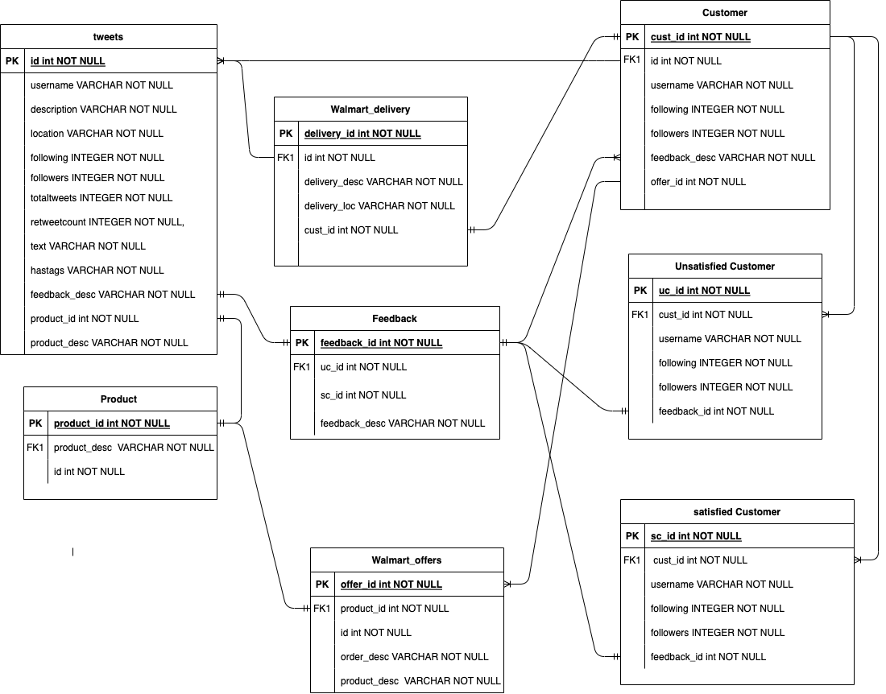
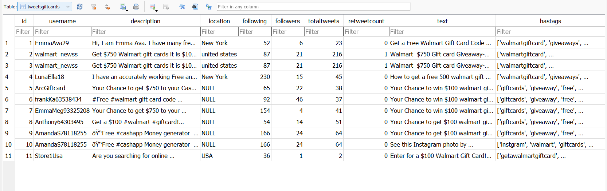
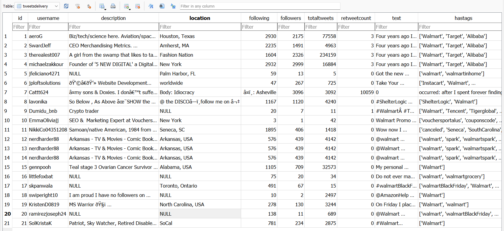
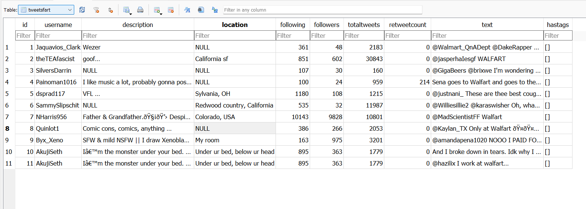
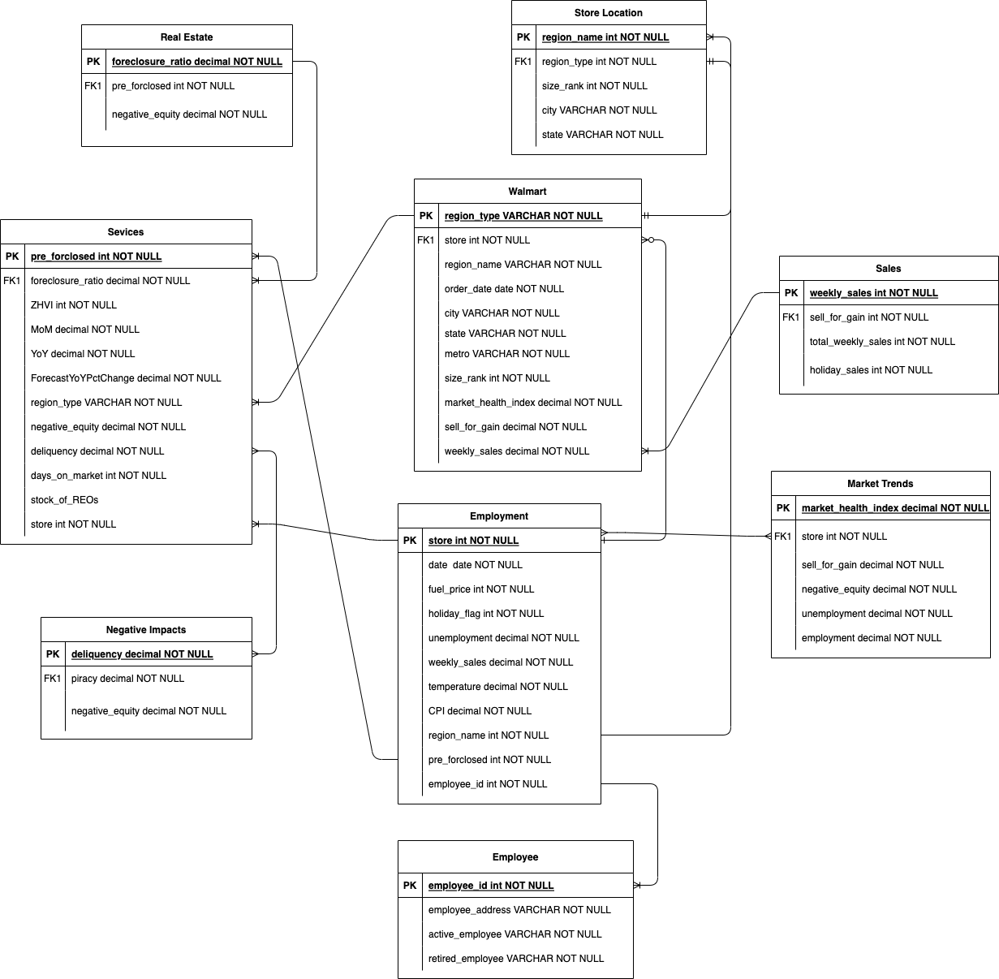
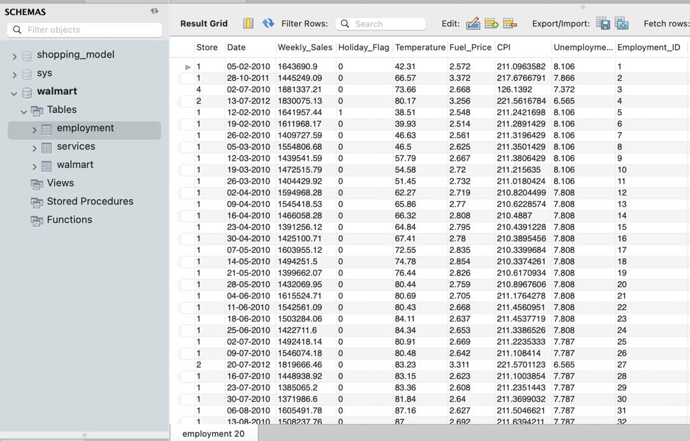
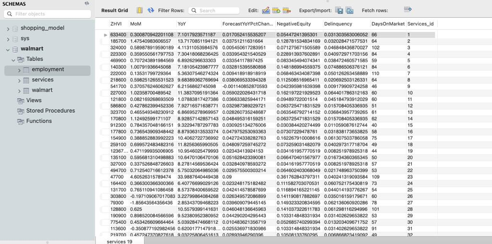
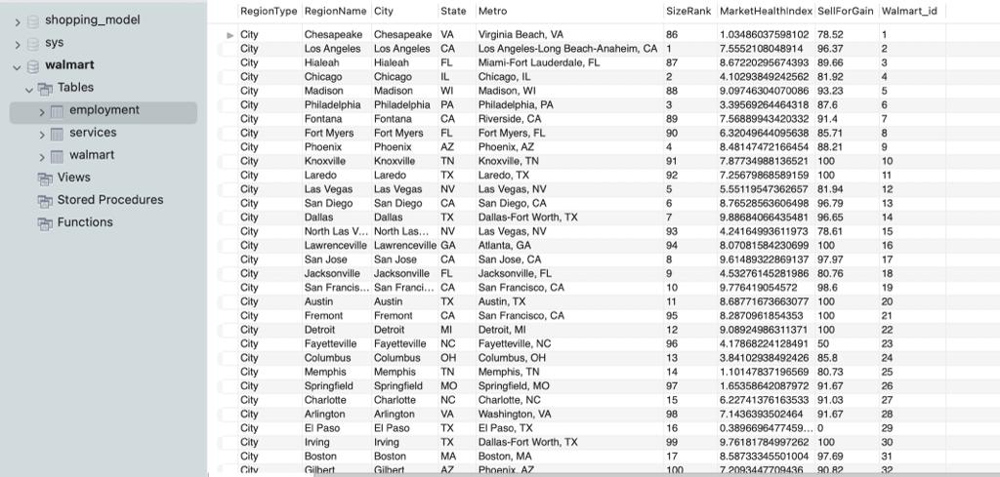

### Twitter Code

```sq
# Python Script to Extract tweets of a
# particular Hashtag using Tweepy and Pandas

# import modules
import pandas as pd
import tweepy

# function to display data of each tweet
def printtweetdata(n, ith_tweet):
		print()
		print(f"Tweet {n}:")
		print(f"Username:{ith_tweet[0]}")
		print(f"Description:{ith_tweet[1]}")
		print(f"Location:{ith_tweet[2]}")
		print(f"Following Count:{ith_tweet[3]}")
		print(f"Follower Count:{ith_tweet[4]}")
		print(f"Total Tweets:{ith_tweet[5]}")
		print(f"Retweet Count:{ith_tweet[6]}")
		print(f"Tweet Text:{ith_tweet[7]}")
		print(f"Hashtags Used:{ith_tweet[8]}"}
		print(f"Created At:{ith_tweet[9]}")


# function to perform data extraction
def scrape(words, date_since, numtweet):

		# Creating DataFrame using pandas
		db = pd.DataFrame(columns=['username',
								'description',
								'location',
								'following',
								'followers',
								'totaltweets',
								'retweetcount',
								'text',
								'hashtags',
					  			'createdat'])

		# We are using .Cursor() to search
		# through twitter for the required tweets.
		# The number of tweets can be
		# restricted using .items(number of tweets)
		tweets = tweepy.Cursor(api.search_tweets,
							words, lang="en",
							since_id=date_since,
							tweet_mode='extended').items(numtweet)


		# .Cursor() returns an iterable object. Each item in
		# the iterator has various attributes
		# that you can access to
		# get information about each tweet
		list_tweets = [tweet for tweet in tweets]

		# Counter to maintain Tweet Count
		i = 1

		# we will iterate over each tweet in the
		# list for extracting information about each tweet
		for tweet in list_tweets:
				username = tweet.user.screen_name
				description = tweet.user.description
				location = tweet.user.location
				following = tweet.user.friends_count
				followers = tweet.user.followers_count
				totaltweets = tweet.user.statuses_count
				retweetcount = tweet.retweet_count
				hashtags = tweet.entities['hashtags']
		      		createdat = tweet.user.created_at

				# Retweets can be distinguished by
				# a retweeted_status attribute,
				# in case it is an invalid reference,
				# except block will be executed
				try:
						text = tweet.retweeted_status.full_text
				except AttributeError:
						text = tweet.full_text
				hashtext = list()
				for j in range(0, len(hashtags)):
						hashtext.append(hashtags[j]['text'])

				# Here we are appending all the
				# extracted information in the DataFrame
				ith_tweet = [username, description,
							location, following,
							followers, totaltweets,
							retweetcount, text, hashtext, createdat]
				db.loc[len(db)] = ith_tweet

				# Function call to print tweet data on screen
				printtweetdata(i, ith_tweet)
				i = i+1
		filename = 'GFG_tweets.csv'

		# we will save our database as a CSV file.
		db.to_csv(filename)

if __name__ == '__main__':

		# Enter your own credentials obtained
		# from your developer account
		consumer_key = "XXXXXXXXXXXXXXXXXXXXXXXXXXXXX"
		consumer_secret = "XXXXXXXXXXXXXXXXXXXXXXXXXXXXXXXXXXX"
		access_key = "XXXXXXXXXXXXXXXXXXXXXXXXXXXXXXXXXXXXXXXXXXXXXXX"
		access_secret = "XXXXXXXXXXXXXXXXXXXXXXXXXXXXXXXXXXXXXXXXXXXXXXX"


		auth = tweepy.OAuthHandler(consumer_key, consumer_secret)
		auth.set_access_token(access_key, access_secret)
		api = tweepy.API(auth)

		# Enter Hashtag and initial date
		print("Enter Twitter HashTag to search for")
		words = input()
		print("Enter Date since The Tweets are required in yyyy-mm--dd")
		date_since = input()

		# number of tweets you want to extract in one run
		numtweet = 100
		scrape(words, date_since, numtweet)
		print('Scraping has completed!')
```

## Updating Database from CSV

```sq

# Import required modules
import csv
import sqlite3

# Connecting to the geeks database
connection = sqlite3.connect('Tweets_Extracted.db')

# Creating a cursor object to execute
# SQL queries on a database table
cursor = connection.cursor()

# Table Definition
create_table = '''CREATE TABLE tweets(
				id INTEGER PRIMARY KEY AUTOINCREMENT,
				username VARCHAR NOT NULL,
				description VARCHAR NOT NULL,
				location VARCHAR NOT NULL,
				following INTEGER NOT NULL,
				followers INTEGER NOT NULL,
				totaltweets INTEGER NOT NULL,
				retweetcount INTEGER NOT NULL,
				text VARCHAR NOT NULL,
				hastags VARCHAR NOT NULL
				);
				'''

# Creating the table into our
# database
cursor.execute(create_table)

# Opening the tweets-records.csv file
file = open('GFG_tweets.csv' , errors='ignore')

# Reading the contents of the
# tweets-records.csv file
contents = csv.reader(file)


# SQL query to insert data into the
# tweets table
# Similar Line is used remaining tables.
insert_records = "INSERT INTO tweets (username, description, location, following, followers, totaltweets, retweetcount, text, hastags) VALUES(?, ?, ?, ?, ?, ?, ?, ?, ?)"

# Importing the contents of the file
# into our tweets table
cursor.executemany(insert_records, contents)

# SQL query to retrieve all data from
# the person table To verify that the
# data of the csv file has been successfully
# inserted into the table
select_all = "SELECT * FROM tweets"
rows = cursor.execute(select_all).fetchall()

# Output to the console screen
for r in rows:
    print(r)

# Committing the changes
connection.commit()

# closing the database connection
connection.close()

```
### UML 



### Table Giftcards:



### Table Tweets:


### Table Delivery


### Table Fart


## SQL on Delivery,Tweets, Farts & Giftcards table. (Basic SQL Statements)

```sq

SQL QUERIES:

1. Create Table Tweets 

CREATE TABLE tweets(
id INTEGER PRIMARY KEY AUTOINCREMENT,
username VARCHAR NOT NULL,
description VARCHAR NOT NULL,
location VARCHAR NOT NULL,
following INTEGER NOT NULL,
followers INTEGER NOT NULL,
totaltweets INTEGER NOT NULL,
retweetcount INTEGER NOT NULL,
text VARCHAR NOT NULL,
hastags VARCHAR NOT NULL)

2. What are tweets about Walmart delivery ?
SELECT (*) FROM tweets WHERE description = "walmart delivery";

3. How many tweets have there been about #walmartsales? 
SELECT COUNT (*) FROM tweets WHERE hastags ="#walmartsales" ;

4. What are the various hashtags related to walmart/sales? 
SELECT COUNT (distinct hastags) FROM tweets WHERE description = "walmartsales"; 

5. How many people/tweets are pleased with Walmart? 
SELECT COUNT(*) FROM tweets WHERE description ="walmart happy customers" OR hastags LIKE '%bestbuy%'; 

6. How many tweets about Walmart delivery are there? 
SELECT COUNT(*) FROM tweets WHERE description ="walmartdelivery" OR hastags ="#walmartdelivery";

7. Who are the actors/influencers promoting deals involving Walmart gift cards? 
SELECT * FROM tweets WHERE description = "EmmaWatson" , hashtags = "#walmartgiftcards" AND description ="influencers" ;

8. Which location has received the most tweets? 
SELECT location , COUNT(totaltweets)
FROM tweets
GROUP BY location DESC LIMIT=1;

9. HP Pavilion product is tweeted the most in which location? 
SELECT location, COUNT(totaltweets) FROM tweets WHERE description like '%HP Pavilion%' ORDER BY location LIMIT=1;

10. What is the total number of tweets/people upset with Walmart using the hashtag #walfart? 
SELECT COUNT(*) FROM tweets WHERE hastags LIKE '%walfart%';

11. What are the most recent Walmart distribution center tweets? 
SELECT * FROM tweets WHERE description = "walmart distribution centre";

12. How many customers are moving from walmart to target? 
SELECT COUNT(*) FROM tweets WHERE description ="no walmart yes target";

13. How many customers are irritated when their order is lost or delivered late? 
SELECT COUNT(*) FROM tweets WHERE description LIKE '%latedelivery%' OR description LIKE '%lost%' AND hastags LIKE '%walfart%';

14. Which top 3 cities received the most gift cards? 
SELECT location , COUNT(*)
FROM tweets
WHERE description LIKE '%win%' OR description like '%offer%' GROUP BY location LIMIT=3;

15. Which of the following people are top 3 Walmart customer who frequently tweet about Walmart? 
SELECT username, COUNT(totaltweets) FROM tweets ORDER BY totaltweets LIMIT=3; 


```

## Python Code for Data Cleaning , Munging 

```sq

import pandas as pd
import numpy as np

#import matplotlib.pyplot as plt

#Dataset 1
walmart_path = 'D:\DMDD\Assignment 3\myCity.csv'

walmart_ori = pd.read_csv(walmart_path)
walmart = walmart_ori.copy()

walmart.head()

walmart.info()

#Function to fetch missing values from Dataset 1
def missing_cols(walmart):
    '''prints out columns with its amount of missing values'''
    total = 0
    for col in walmart.columns:
        missing_vals = walmart[col].isnull().sum()
        total += missing_vals
        if missing_vals != 0:
            print(f"{col} => {walmart[col].isnull().sum()}")
    
    if total == 0:
        print("no missing values left")
            
#Missing Columns Values in Walmart Dataframe            
missing_cols(walmart)

def perc_missing(walmart):
    '''prints out columns with missing values with its %'''
    for col in walmart.columns:
        pct = walmart[col].isna().mean() * 100
        if (pct != 0):
            print('{} => {}%'.format(col, round(pct, 2)))

#Percentage Wise Missing Values
perc_missing(walmart)

# Drop unnecessary columns that are not important
colsToDrop = ['StockOfREOs','PrevForeclosed','ForeclosureRatio']

walmart.drop(colsToDrop, axis=1, inplace=True)

#Missing Values Redefined
missing_cols(walmart)

#Percentage Wise Missing Values
perc_missing(walmart)


# imputing with bfill or ffill
walmart['Metro'].bfill(inplace=True)
walmart['Metro'].ffill(inplace=True)
walmart['SizeRank'].bfill(inplace=True)
walmart['SizeRank'].ffill(inplace=True)
walmart['SellForGain'].bfill(inplace=True)
walmart['SellForGain'].ffill(inplace=True)
walmart['ZHVI'].bfill(inplace=True)
walmart['ZHVI'].ffill(inplace=True)
walmart['MoM'].bfill(inplace=True)
walmart['MoM'].ffill(inplace=True)
walmart['ForecastYoYPctChange'].ffill(inplace=True)
walmart['ForecastYoYPctChange'].bfill(inplace=True)
walmart['YoY'].ffill(inplace=True)
walmart['YoY'].ffill(inplace=True)
walmart['Delinquency'].ffill(inplace=True)
walmart['Delinquency'].ffill(inplace=True)
walmart['DaysOnMarket'].ffill(inplace=True)
walmart['DaysOnMarket'].ffill(inplace=True)
walmart['NegativeEquity'].ffill(inplace=True)
walmart['NegativeEquity'].ffill(inplace=True)

#DF Post Cleaning
missing_cols(walmart)


#Cleaned DF 1
print (walmart)

#Cleaned Data Inserted into CSV
csv_data = walmart.to_csv('D:\DMDD\Assignment 3\Cleaned_1.csv', index = False)


# Import required modules
import csv
import sqlite3

# Connecting to the geeks database
connection = sqlite3.connect('D:\DMDD\Assignment 3\Cleaned_DB.db')

# Creating a cursor object to execute
# SQL queries on a database table
cursor = connection.cursor()

# Table Definition
create_table = '''CREATE TABLE IF NOT EXISTS walmart (
				id INTEGER PRIMARY KEY AUTOINCREMENT,
                RegionType VARCHAR NOT NULL, 
                RegionName VARCHAR NOT NULL, 
                City VARCHAR NOT NULL, 
                State VARCHAR NOT NULL, 
                Metro VARCHAR NOT NULL, 
                SizeRank INTEGER NOT NULL, 
                MarketHealthIndex INTEGER NOT NULL, 
                SellForGain INTEGER NOT NULL, 
                ZHVI INTEGER NOT NULL, 
                MoM INTEGER NOT NULL, 
                YoY INTEGER NOT NULL, 
                ForecastYoYPctChange INTEGER NOT NULL, 
                NegativeEquity INTEGER NOT NULL, 
                Delinquency INTEGER NOT NULL,
                DaysOnMarket INTEGER NOT NULL
				);
				'''

# Creating the table into our
# database
cursor.execute(create_table)

# Opening the tweets-records.csv file
file = open('D:\DMDD\Assignment 3\Cleaned.csv' , errors='ignore')

# Reading the contents of the
# tweets-records.csv file
contents = csv.reader(file)


# SQL query to insert data into the
# tweets table
insert_records = "INSERT INTO walmart (RegionType, RegionName,	City,	State,	Metro,	SizeRank,	MarketHealthIndex,	SellForGain,	ZHVI,	MoM,	YoY,	ForecastYoYPctChange, NegativeEquity, Delinquency,	DaysOnMarket) VALUES( ?, ?, ?, ?, ?, ?, ?, ?, ?, ?, ?, ?, ?, ?, ?)"

# Importing the contents of the file
# into our tweets table
cursor.executemany(insert_records, contents)

# SQL query to retrieve all data from
# the person table To verify that the
# data of the csv file has been successfully
# inserted into the table
# Change Table to tweets after the SQL
select_all = "SELECT * FROM walmart"
rows = cursor.execute(select_all).fetchall()

# Output to the console screen
for r in rows:
    print(r)

# Committing the changes
connection.commit()

# closing the database connection
connection.close()


#Dataset 2
walmart_path_1 = 'D:\DMDD\Assignment 3\Walmart.csv'

walmart_ori_1 = pd.read_csv(walmart_path_1)
walmart_1 = walmart_ori_1.copy()

walmart_1.head()

walmart_1.info()

#Function to fetch missing values from Dataset 1
def missing_cols(walmart_1):
    '''prints out columns with its amount of missing values'''
    total = 0
    for col in walmart_1.columns:
        missing_vals = walmart_1[col].isnull().sum()
        total += missing_vals
        if missing_vals != 0:
            print(f"{col} => {walmart_1[col].isnull().sum()}")
    
    if total == 0:
        print("no missing values left")

missing_cols(walmart_1)

# Connecting to the geeks database
connection = sqlite3.connect('D:\DMDD\Assignment 3\Cleaned_DB.db')

# Creating a cursor object to execute
# SQL queries on a database table
cursor = connection.cursor()

# Table Definition
create_table = '''CREATE TABLE IF NOT EXISTS employment (
				id INTEGER PRIMARY KEY AUTOINCREMENT,
                Store INTEGER NOT NULL,
                Date INTEGER NOT NULL,
                Weekly_Sales INTEGER NOT NULL,	
                Holiday_Flag INTEGER NOT NULL,
                Temperature	INTEGER NOT NULL,
                Fuel_Price INTEGER NOT NULL,
                CPI INTEGER NOT NULL,
                Unemployment INTEGER NOT NULL
				);
				'''

# Creating the table into our
# database
cursor.execute(create_table)

# Opening the tweets-records.csv file
file = open('D:\DMDD\Assignment 3\Walmart.csv' , errors='ignore')

# Reading the contents of the
# tweets-records.csv file
contents = csv.reader(file)


# SQL query to insert data into the
# tweets table
insert_records = "INSERT INTO employment (Store, Date, Weekly_Sales, Holiday_Flag, Temperature, Fuel_Price, CPI, Unemployment) VALUES( ?, ?, ?, ?, ?, ?, ?, ?)"

# Importing the contents of the file
# into our tweets table
cursor.executemany(insert_records, contents)

# SQL query to retrieve all data from
# the person table To verify that the
# data of the csv file has been successfully
# inserted into the table
# Change Table to tweets after the SQL
select_all = "SELECT * FROM employment"
rows = cursor.execute(select_all).fetchall()

# Output to the console screen
for r in rows:
    print(r)

# Committing the changes
connection.commit()

# closing the database connection
connection.close()

```
## UML Diagram:



## Employment Table:
The table is normalized and also its cleaned.



## Services Table:
The table is normalized and also its cleaned.


## Walmart Table:
The table is normalized and also its cleaned.


## SQL on Walmart,Services and Employment Table ( SQL JOINS Statements ):

```sq

1. Find total weekly sales of each store.
SQL--> SELECT Store , SUM(Weekly_Sales) as Total_weeklysales FROM employment GROUP BY Store;

2. Find dates on which Walmart store had Fuel_Price > 3.5 and Holiday_Flag was 0
SQL-->  SELECT Store, Date , Fuel_Price, Holiday_Flag FROM employment WHERE Holiday_Flag=0 AND Fuel_Price > 3.5;

3. Select min of Unemployment of store 1 and sales between 1542561.09 and 1606629.58 
SQL-->  SELECT MIN(Unemployment), Store from employment WHERE STORE=1 AND Weekly_Sales BETWEEN 1542561.09 AND 1606629.58 GROUP BY Store;

4. Find average weekly sales of each store.
SQL-->  SELECT AVG(Weekly_Sales), Store from employment GROUP BY Store;

5. List the number of customers in each country. Only include STORES with less than 3 Holiday_flag
SQL-->   SELECT Store, SUM(Holiday_Flag) FROM employment GROUP BY Store HAVING SUM(Holiday_Flag) >9;

6. Show all the DaysOnMarket where CITY is Phoenix
SQL-->  SELECT walmart.RegionName, walmart.City, services.DaysOnMarket  from  walmart INNER JOIN services ON walmart.Walmart_id = services.services_id  where City="Phoenix";

7. Finding out Maximum SizeRank, RegionName, City where DaysOnMarket=106
SQL-->  SELECT walmart.SizeRank, walmart.RegionName, walmart.City, services.DaysOnMarket from walmart INNER JOIN services ON walmart.Walmart_id = services.services_id  WHERE SizeRank=(SELECT MAX(SizeRank) from walmart) AND  services.DaysOnMarket=106;

8. Finding cities and region where  NegativeEquity < Delinquency
SQL-->  SELECT walmart.RegionName, walmart.City, services.NegativeEquity, services.Delinquency from walmart INNER JOIN services ON walmart.Walmart_id = services.services_id WHERE  NegativeEquity < Delinquency;

9. Show all cities an regions with any DaysOnMarket they might have
SQL-->  SELECT walmart.RegionName, walmart.City,  services.DaysOnMarket FROM walmart LEFT JOIN services ON walmart.Walmart_id = services.services_id;

10. Show all cities, regions, state with All DaysOnMarket in the table
SQL-->  SELECT walmart.RegionName, walmart.City, walmart.State, services.DaysOnMarket FROM walmart LEFT JOIN services ON walmart.Walmart_id = services.services_id UNION SELECT walmart.RegionName, walmart.City, walmart.State, services.DaysOnMarket FROM walmart LEFT JOIN services ON walmart.Walmart_id = services.services_id ;

11. Show the list of NegativeEquity, Delinquency, regions in Massachusetts state and city is Boston 
SQL-->  SELECT walmart.RegionName, walmart.City, services.NegativeEquity, services.Delinquency  from  walmart INNER JOIN services ON walmart.Walmart_id = services.services_id WHERE City=“Boston";

12. Finding out Maximum SellForGain, RegionName, City where ZHVI >= 695600
SQL-->  SELECT walmart.SellForGain, walmart.RegionName, walmart.City, services.ZHVI from walmart INNER JOIN services ON walmart.Walmart_id = services.services_id WHERE SellForGain=(SELECT MAX(SellForGain) from walmart) AND services.ZHVI =190900;

13. Show DaysOnMarket in each state
SQL-->  SELECT walmart.State, SUM(services.DaysOnMarket) from walmart INNER JOIN services ON walmart.Walmart_id = services.services_id GROUP BY State;

14. Select store which has the highest weekly sale on this 05-02-2010 date
SQL-->  SELECT Store, Weekly_Sales, Date from employment where Date = 05-02-2010  AND Weekly_Sales=(SELECT MAX(Weekly_Sales) from employment );

15. Finding out Minimum MarketHealthIndex, RegionName, City where MoM=1.00791936645068
SQL--> SELECT walmart.MarketHealthIndex, walmart.RegionName, walmart.City, services.MoM from walmart INNER JOIN services ON walmart.Walmart_id = services.services_id WHERE MarketHealthIndex=(SELECT MAX(MarketHealthIndex) from walmart) OR MoM= 1.00791936645068;

```


```sq

## SQL Views:

VIEWS FOR THE USE CASES CREATED:

1. Find total weekly sales of each store.
VIEW --> CREATE VIEW  total_sales AS SELECT Store , SUM(Weekly_Sales) as Total_weeklysales FROM employment GROUP BY Store;

2. Find dates on which Walmart store had Fuel_Price > 3.5 and Holiday_Flag was 0
VIEW --> CREATE VIEW fuelprice AS  SELECT Store, Date , Fuel_Price, Holiday_Flag FROM employment WHERE Holiday_Flag=0 AND Fuel_Price > 3.5;

3. Select min of Unemployment of store 1 and sales between 1542561.09 and 1606629.58 
VIEW --> CREATE VIEW Min_unemployemnt AS SELECT MIN(Unemployment), Store from employment WHERE STORE=1 AND Weekly_Sales BETWEEN 1542561.09 AND 1606629.58 GROUP BY Store;

4. Find average weekly sales of each store.
VIEW --> CREATE VIEW Avg_weekly_sales AS SELECT AVG(Weekly_Sales), Store from employment GROUP BY Store;

5. List the number of customers in each country. Only include STORES with less than 3 Holiday_flag
VIEW --> CREATE VIEW Sum_holiday_flag AS SELECT Store, SUM(Holiday_Flag) FROM employment GROUP BY Store HAVING SUM(Holiday_Flag) >9;

6. Show all the DaysOnMarket where CITY is Phoenix
VIEW --> CREATE VIEW DOM_Phoenix AS SELECT walmart.RegionName, walmart.City, services.DaysOnMarket  from  walmart INNER JOIN services ON walmart.Walmart_id = services.services_id  where City="Phoenix";

7. Finding out Maximum SizeRank, RegionName, City where DaysOnMarket=106
VIEW --> CREATE VIEW DOM AS SELECT walmart.SizeRank, walmart.RegionName, walmart.City, services.DaysOnMarket from walmart INNER JOIN services ON walmart.Walmart_id = services.services_id  WHERE SizeRank=(SELECT MAX(SizeRank) from walmart) AND  services.DaysOnMarket=106;

8. Finding cities and region where  NegativeEquity < Delinquency
VIEW --> CREATE VIEW sales_services AS SELECT walmart.RegionName, walmart.City, services.NegativeEquity, services.Delinquency from walmart INNER JOIN services ON walmart.Walmart_id = services.services_id WHERE  NegativeEquity < Delinquency;

9. Show all cities an regions with any DaysOnMarket they might have
VIEW --> CREATE VIEW All_dom AS SELECT walmart.RegionName, walmart.City,  services.DaysOnMarket FROM walmart LEFT JOIN services ON walmart.Walmart_id = services.services_id;

10. Show all cities, regions, state with All DaysOnMarket in the table
VIEW --> CREATE VIEW Services_dom AS SELECT walmart.RegionName, walmart.City, walmart.State, services.DaysOnMarket FROM walmart LEFT JOIN services ON walmart.Walmart_id = services.services_id UNION SELECT walmart.RegionName, walmart.City, walmart.State, services.DaysOnMarket FROM walmart LEFT JOIN services ON walmart.Walmart_id = services.services_id ;

11. Show the list of NegativeEquity, Delinquency, regions in Massachusetts state and city is Boston 
VIEW --> CREATE VIEW negative_equity AS SELECT walmart.RegionName, walmart.City, services.NegativeEquity, services.Delinquency  from  walmart INNER JOIN services ON walmart.Walmart_id = services.services_id WHERE City= "Boston";

12. Finding out Maximum SellForGain, RegionName, City where ZHVI >= 695600
VIEW --> CREATE VIEW ZHVI AS  SELECT walmart.SellForGain, walmart.RegionName, walmart.City, services.ZHVI from walmart INNER JOIN services ON walmart.Walmart_id = services.services_id WHERE SellForGain=(SELECT MAX(SellForGain) from walmart) AND services.ZHVI =190900;

13. Show DaysOnMarket in each state
VIEW--> CREATE VIEW DOM_states AS SELECT walmart.State, SUM(services.DaysOnMarket) from walmart INNER JOIN services ON walmart.Walmart_id = services.services_id GROUP BY State;

14. Select store which has the highest weekly sale on this 05-02-2010 date
VIEW --> CREATE VIEW weekly_sales AS SELECT Store, Weekly_Sales, Date from employment where Date = 05-02-2010  AND Weekly_Sales=(SELECT MAX(Weekly_Sales) from employment );

15. Finding out Minimum MarketHealthIndex, RegionName, City where MoM=1.00791936645068
VIEW --> CREATE VIEW min_MHI AS SELECT walmart.MarketHealthIndex, walmart.RegionName, walmart.City, services.MoM from walmart INNER JOIN services ON walmart.Walmart_id = services.services_id WHERE MarketHealthIndex=(SELECT MAX(MarketHealthIndex) from walmart) OR MoM= 1.00791936645068;

```
