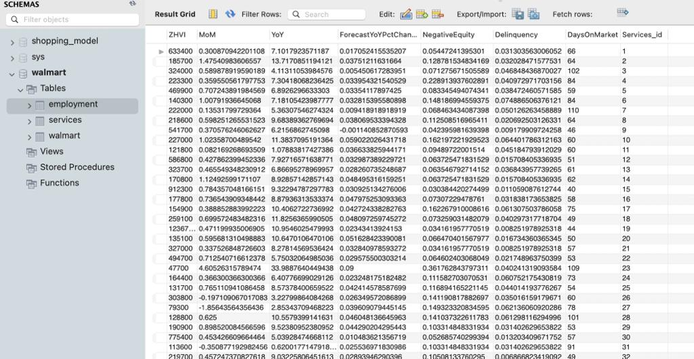
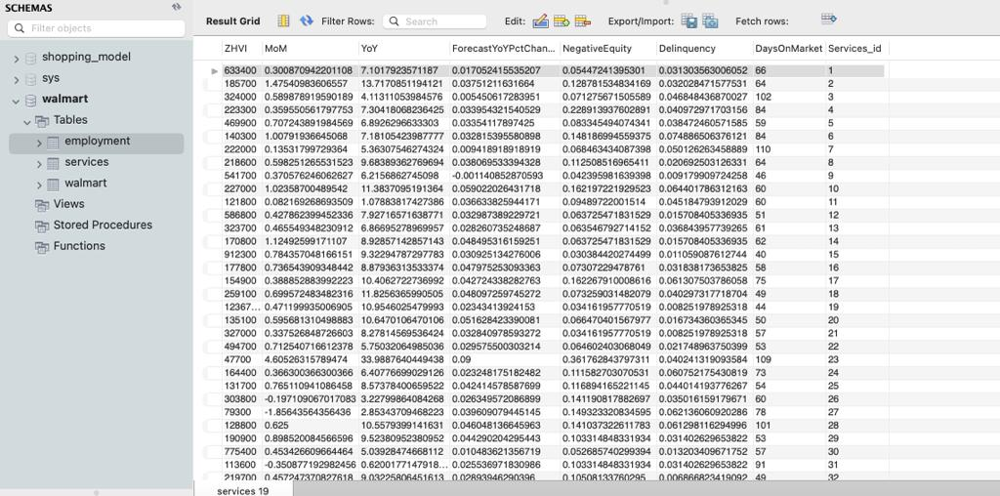
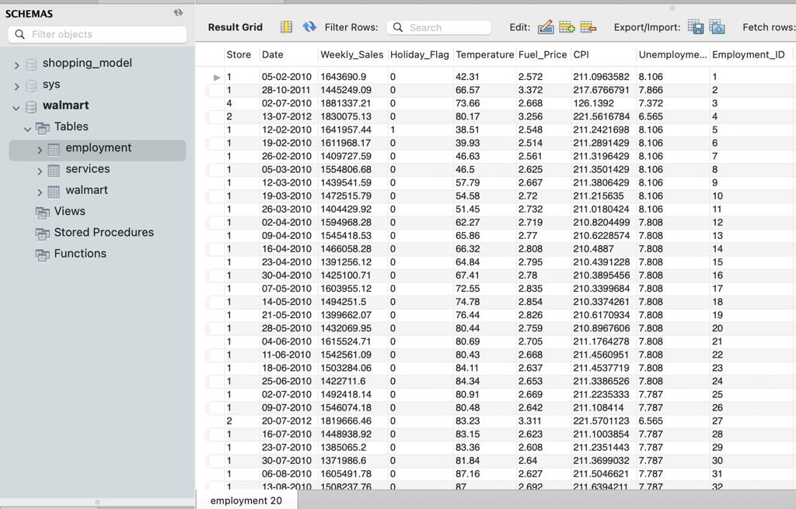

# NORMALIZATION OF WALMART SALES DATABASE

### Walmart Table:
Walmart table contains different stores across different regions along with their market health index, size rank and sale for gain
- Primary key for this table is Walmart_Id

### Services Table
Services Table contains different store details like their ZHVI ,Mom, YoY
- Primary key for this table is Services_ID
- Foreign key for this table is Employment_Id

### Employment Table
Employment Table contains different store details like their weekly sales,unemployment percent etc
- Primary key for this table is Employment_Id
- Foreign key for this table is Services_ID

## VIEWS CREATED FOR THE USECASES

1. Find total weekly sales of each store.
VIEW--> CREATE VIEW  total_sales AS SELECT Store , SUM(Weekly_Sales) as Total_weeklysales FROM employment GROUP BY Store;

2. Find dates on which Walmart store had Fuel_Price > 3.5 and Holiday_Flag was 0
VIEW--> CREATE VIEW fuelprice AS  SELECT Store, Date , Fuel_Price, Holiday_Flag FROM employment WHERE Holiday_Flag=0 AND Fuel_Price > 3.5;

3. Select min of Unemployment of store 1 and sales between 1542561.09 and 1606629.58 
VIEW--> CREATE VIEW Min_unemployemnt AS SELECT MIN(Unemployment), Store from employment WHERE STORE=1 AND Weekly_Sales BETWEEN 1542561.09 AND 1606629.58 GROUP BY Store;

4. Find average weekly sales of each store.
VIEW--> CREATE VIEW Avg_weekly_sales AS SELECT AVG(Weekly_Sales), Store from employment GROUP BY Store;

5. List the number of customers in each country. Only include STORES with less than 3 Holiday_flag
VIEW--> CREATE VIEW Sum_holiday_flag AS SELECT Store, SUM(Holiday_Flag) FROM employment GROUP BY Store HAVING SUM(Holiday_Flag) >9;

6. Show all the DaysOnMarket where CITY is Phoenix
VIEW--> CREATE VIEW DOM_Phoenix AS SELECT walmart.RegionName, walmart.City, services.DaysOnMarket  from  walmart INNER JOIN services ON walmart.Walmart_id = services.services_id  where City="Phoenix";

7. Finding out Maximum SizeRank, RegionName, City where DaysOnMarket=106
VIEW--> CREATE VIEW DOM AS SELECT walmart.SizeRank, walmart.RegionName, walmart.City, services.DaysOnMarket from walmart INNER JOIN services ON walmart.Walmart_id = services.services_id  WHERE SizeRank=(SELECT MAX(SizeRank) from walmart) AND  services.DaysOnMarket=106;

8. Finding cities and region where  NegativeEquity < Delinquency
VIEW--> CREATE VIEW sales_services AS SELECT walmart.RegionName, walmart.City, services.NegativeEquity, services.Delinquency from walmart INNER JOIN services ON walmart.Walmart_id = services.services_id WHERE  NegativeEquity < Delinquency;

9. Show all cities an regions with any DaysOnMarket they might have
VIEW--> CREATE VIEW All_dom AS SELECT walmart.RegionName, walmart.City,  services.DaysOnMarket FROM walmart LEFT JOIN services ON walmart.Walmart_id = services.services_id;

10. Show all cities, regions, state with All DaysOnMarket in the table
VIEW--> CREATE VIEW Services_dom AS SELECT walmart.RegionName, walmart.City, walmart.State, services.DaysOnMarket FROM walmart LEFT JOIN services ON walmart.Walmart_id = services.services_id UNION SELECT walmart.RegionName, walmart.City, walmart.State, services.DaysOnMarket FROM walmart LEFT JOIN services ON walmart.Walmart_id = services.services_id ;

11. Show the list of NegativeEquity, Delinquency, regions in Massachusetts state and city is Boston 
VIEW--> CREATE VIEW negative_equity AS SELECT walmart.RegionName, walmart.City, services.NegativeEquity, services.Delinquency  from  walmart INNER JOIN services ON walmart.Walmart_id = services.services_id WHERE City= "Boston";

12. Finding out Maximum SellForGain, RegionName, City where ZHVI >= 695600
VIEW--> CREATE VIEW ZHVI AS  SELECT walmart.SellForGain, walmart.RegionName, walmart.City, services.ZHVI from walmart INNER JOIN services ON walmart.Walmart_id = services.services_id WHERE SellForGain=(SELECT MAX(SellForGain) from walmart) AND services.ZHVI =190900;

13. Show DaysOnMarket in each state
VIEW--> CREATE VIEW DOM_states AS SELECT walmart.State, SUM(services.DaysOnMarket) from walmart INNER JOIN services ON walmart.Walmart_id = services.services_id GROUP BY State;

14. Select store which has the highest weekly sale on this 05-02-2010 date
VIEW--> CREATE VIEW weekly_sales AS SELECT Store, Weekly_Sales, Date from employment where Date = 05-02-2010  AND Weekly_Sales=(SELECT MAX(Weekly_Sales) from employment );

15. Finding out Minimum MarketHealthIndex, RegionName, City where MoM=1.00791936645068
VIEW--> CREATE VIEW min_MHI AS SELECT walmart.MarketHealthIndex, walmart.RegionName, walmart.City, services.MoM from walmart INNER JOIN services ON walmart.Walmart_id = services.services_id WHERE MarketHealthIndex=(SELECT MAX(MarketHealthIndex) from walmart) OR MoM= 1.00791936645068;

