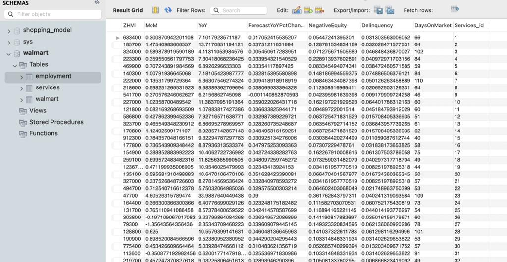
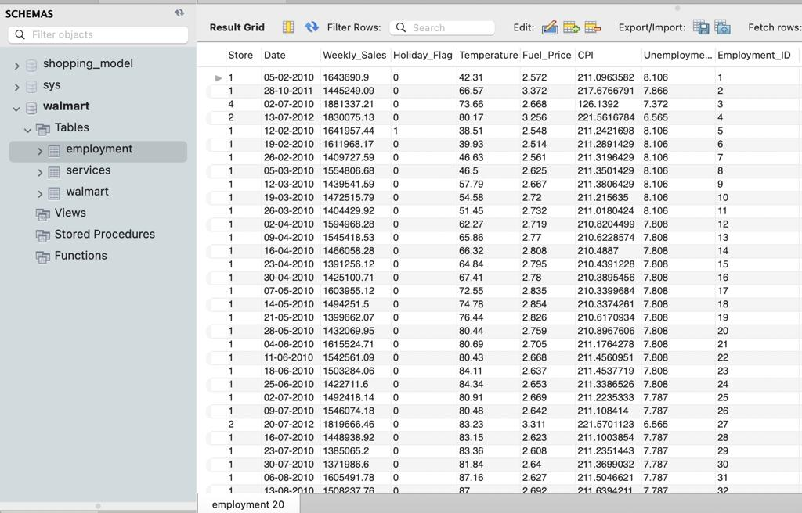

# Normalization — Walmart Sales Database 📐

  
  

---

## 📖 Overview

This document walks through the **normalization to 3NF** for all three tables in the Walmart Sales database. Each table is verified against 1st, 2nd, and 3rd Normal Form criteria. SQL VIEWs are defined for the 15 analytical use cases.

---

## 🗄️ Tables

### 🏬 Walmart Table

Stores across different U.S. regions with market health, size rank, and sale-for-gain indicators.

| Property | Value |
|----------|-------|
| **Primary Key** | `Walmart_Id` |
| **Foreign Key** | `services_id` → Services |

#### Normalization

| Normal Form | Satisfied | Rationale |
|-------------|-----------|-----------|
| **1NF** | ✅ | Single PK (`walmart_id`), no multi-value attributes, no duplicate-purpose columns |
| **2NF** | ✅ | No redundant data; related to Services via FK `services_id` |
| **3NF** | ✅ | No transitive dependencies — all fields depend solely on the PK |

---

### 🔧 Services Table

Store-level market detail: ZHVI, MoM, YoY, NegativeEquity, Delinquency, DaysOnMarket.

| Property | Value |
|----------|-------|
| **Primary Key** | `Services_Id` |
| **Foreign Key** | `Employment_Id` → Employment |

#### Normalization

| Normal Form | Satisfied | Rationale |
|-------------|-----------|-----------|
| **1NF** | ✅ | Single PK (`services_id`), atomic values, no duplicate-purpose columns |
| **2NF** | ✅ | No redundant data; related to Walmart via FK `walmart_id` |
| **3NF** | ✅ | No transitive dependencies — all fields depend solely on the PK |

---

### 💼 Employment Table

Store-level weekly sales with economic indicators (temperature, fuel price, CPI, unemployment).

| Property | Value |
|----------|-------|
| **Primary Key** | `Employment_Id` |
| **Foreign Key** | `Services_Id` → Services |

#### Normalization

| Normal Form | Satisfied | Rationale |
|-------------|-----------|-----------|
| **1NF** | ✅ | Single PK (`employment_id`), atomic values, no duplicate-purpose columns |
| **2NF** | ✅ | No redundant data; no need for further decomposition |
| **3NF** | ✅ | No transitive dependencies — all fields depend solely on the PK |

---

## 👁️ SQL VIEWs

The following VIEWs are defined for the 15 analytical use cases (full SQL in `Views.txt`):

| # | View Name | Description |
|---|-----------|-------------|
| 1 | `total_sales` | Total weekly sales per store |
| 2 | `fuelprice` | Store dates where Fuel_Price > 3.5 and no holiday |
| 3 | `Min_unemployemnt` | Min unemployment for Store 1 within a sales range |
| 4 | `Avg_weekly_sales` | Average weekly sales per store |
| 5 | `Sum_holiday_flag` | Stores with holiday flag sum > 9 |
| 6 | `DOM_Phoenix` | DaysOnMarket for Phoenix (JOIN) |
| 7 | `DOM` | Max SizeRank regions where DaysOnMarket = 106 (JOIN) |
| 8 | `sales_services` | Cities where NegativeEquity < Delinquency (JOIN) |
| 9 | `All_dom` | All cities and regions with DaysOnMarket (LEFT JOIN) |
| 10 | `Services_dom` | All cities/regions/states with DaysOnMarket (UNION) |
| 11 | `negative_equity` | NegativeEquity & Delinquency in Boston (JOIN) |
| 12 | `ZHVI` | Max SellForGain regions by ZHVI threshold (JOIN) |
| 13 | `DOM_states` | Total DaysOnMarket by state (JOIN) |
| 14 | `weekly_sales` | Highest weekly sale on 05-02-2010 |
| 15 | `min_MHI` | Min MarketHealthIndex by MoM threshold (JOIN) |

---

## 👥 Team

| Name | GitHub |
|------|--------|
| **Sahil Gothoskar** | [@SahilGothoskar](https://github.com/SahilGothoskar) |
| **Sneha Giranje** | [@snehagiranje27](https://github.com/snehagiranje27) |
| **Arundhati Pathrikar** | [@ArundhatiCat](https://github.com/ArundhatiCat) |

Git: https://github.com/SahilGothoskar/Sales/tree/main/Normalization

